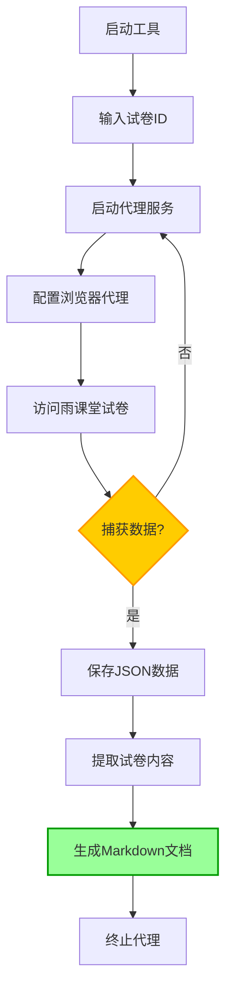

# 雨课堂工具集合

一套完整的雨课堂相关工具，提供试卷提取、答案获取和多文件比较功能。

## 📊 功能特点

### 🔧 试卷提取
- 自动捕获雨课堂试卷数据
- 支持选项重排序功能
- 将试卷内容转换为Markdown格式，方便阅读与编辑

### 📋 答案获取  
- 直接获取雨课堂试卷答案
- 保存为CSV格式便于后续处理
- 支持自定义文件名和输出目录

### 📊 多文件比较
- 比较多个答案CSV文件
- 找出不同答案的题目
- 生成详细的差异报告

### 🎨 统一界面
- 使用CustomTkinter提供现代化UI
- Tab页面设计，功能模块化
- 实时日志输出，操作状态可视化

## 🔧 安装准备

### 安装依赖

```cmd
pip install -r requirements.txt
```

### 创建虚拟环境(推荐)

```cmd
# 创建环境
python -m venv venv

# 激活环境(Windows)
venv\Scripts\activate

# 激活环境(Linux/Mac)
source venv/bin/activate
```

## 🚀 使用方法

### 图形界面模式 (推荐)

```cmd
python start.py
```

操作步骤：
1. 输入雨课堂试卷ID
2. 点击「启动代理」按钮
3. 在浏览器中配置代理(127.0.0.1:11000)并访问雨课堂试卷页面
4. 数据捕获成功后，点击「提取试卷内容」按钮

### 命令行模式

```cmd
# 启动代理服务
mitmdump -s proxy\yuketang_proxy.py

# 提取试卷内容
python tools\json_handle.py
```

## 🌐 浏览器代理设置

1. 设置浏览器代理为 `127.0.0.1:11000`
2. 首次使用需要安装证书，访问 http://mitm.it 并按照指引安装
3. 访问雨课堂试卷页面，程序会自动捕获数据

## 💡 使用提示

- 如遇端口占用问题，程序会自动尝试终止占用进程
- 试卷提取结果将保存在"处理后的文档"目录下，格式为Markdown
- 日志文件保存在logs目录下，便于问题排查

## ❓ 常见问题

### Q: 为什么看不到输出？
A: 检查控制台输出重定向是否正常，或查看logs目录下的日志文件

### Q: 端口被占用怎么办？
A: 使用以下命令查找并手动终止占用进程
```cmd
netstat -ano | findstr 11000
taskkill /F /PID 进程ID
```

### Q: 如何确认代理正常工作？
A: 启动代理后访问 http://mitm.it ，若能显示证书安装页面则表明代理工作正常

## 📂 项目结构

```
MITM-Yuketang/
├── proxy/                      # 代理相关模块
│   ├── proxy_manager.py        # 管理代理进程的启动、监控与终止
│   └── yuketang_proxy.py       # 实现拦截雨课堂流量并提取数据的核心逻辑
├── tools/                      # 工具模块
│   └── json_handle.py          # 处理JSON数据并转换为Markdown格式
├── ui/                         # 用户界面
│   └── main_window.py          # 图形界面实现
├── utils/                      # 实用工具
│   └── stdout_redirector.py    # 控制台输出重定向工具
├── logs/                       # 日志文件目录
│   └── proxy.log               # 代理服务器日志记录
├── 雨课堂文档/                 # 原始数据存储目录
│   └── exam_data.json          # 从雨课堂捕获的试卷JSON数据
├── 处理后的文档/               # 转换后的Markdown文件保存目录
├── start.py                    # 程序启动入口文件
└── requirements.txt            # 项目依赖文件
```

## 🔄 工作流程



## 📝 结语

本工具旨在简化雨课堂试卷内容的提取与格式转换过程。如有问题或建议，欢迎提出反馈，我将持续改进。