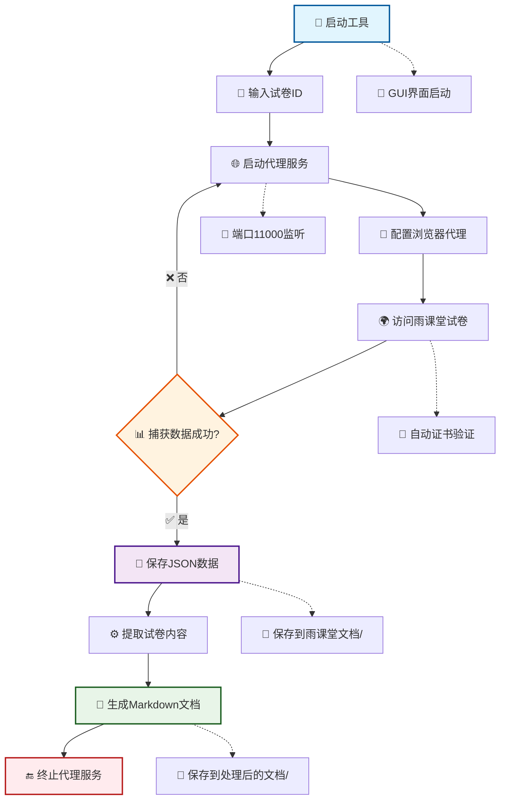

# 🎓 雨课堂工具集合 (YuKeTang Toolkit)

[](https://www.python.org/downloads/)
[](LICENSE)
[](https://www.microsoft.com/windows)

> 🚀 一套功能强大的雨课堂教学辅助工具，提供试卷内容提取、答案数据获取和多文件智能对比功能

## ✨ 功能特点

### 📝 试卷内容提取
- 🎯 **智能代理捕获** - 自动拦截并捕获雨课堂试卷数据
- 🔄 **选项重排序** - 支持将选项按ABCD顺序重新排列
- 📖 **Markdown转换** - 将试卷内容转换为结构化Markdown格式
- 💾 **本地保存** - 自动保存处理后的文档到本地目录

### 📊 答案数据获取  
- 🔍 **直接API调用** - 通过官方API直接获取试卷答案数据
- 💾 **CSV格式导出** - 将答案数据保存为易于处理的CSV格式
- 🎛️ **自定义配置** - 支持自定义文件名和输出目录
- 🔐 **认证支持** - 支持x_access_token认证访问

### 🔍 多文件智能对比
- 📂 **批量文件处理** - 同时比较多个答案CSV文件
- 🎯 **差异识别** - 智能识别并标记不同答案的题目
- 📋 **详细报告** - 生成包含差异详情的完整对比报告
- 📊 **数据分析** - 提供答案统计和分析功能

### 🎨 现代化用户界面
- 🖥️ **CustomTkinter UI** - 采用现代化的图形用户界面
- 📑 **Tab页面设计** - 功能模块化，操作简便直观
- 📝 **实时日志** - 实时显示操作状态和处理进度
- 🎯 **状态可视化** - 清晰的状态指示和错误提示

## 🚀 快速开始

### 📋 系统要求

- **操作系统**: Windows 10/11 (推荐)
- **Python版本**: 3.7 或更高版本
- **网络环境**: 需要访问雨课堂平台

### ⚡ 一键安装

```bash
# 📥 克隆项目
git clone https://github.com/your-username/yuketang-toolkit.git
cd yuketang-toolkit

# 🔧 安装依赖
pip install -r requirements.txt
```

### 🌐 虚拟环境 (推荐)

```bash
# 📦 创建虚拟环境
python -m venv venv

# 🔧 激活环境 (Windows)
venv\Scripts\activate

# 🔧 激活环境 (Linux/Mac)
source venv/bin/activate

# 📥 安装依赖
pip install -r requirements.txt
```

## 📖 使用指南

### 🖥️ 图形界面模式 (推荐)

```bash
# 🚀 启动应用
python app.py
```

### 📝 试卷提取操作流程

1. **📌 输入试卷信息**
   - 在"试卷提取"标签页输入雨课堂试卷ID
   
2. **🌐 启动代理服务**
   - 点击"启动代理"按钮
   - 程序将在 `127.0.0.1:11000` 启动代理服务
   
3. **🔧 配置浏览器代理**
   - 设置浏览器HTTP代理为 `127.0.0.1:11000`
   - 首次使用需访问 [mitm.it](http://mitm.it) 安装证书
   
4. **📊 访问试卷页面**
   - 在配置代理的浏览器中访问雨课堂试卷页面
   - 程序将自动捕获并保存试卷数据
   
5. **⚙️ 处理数据**
   - 数据捕获成功后，点击"提取试卷内容"按钮
   - 选择是否重新排序选项 (ABCD顺序)
   - 程序将生成Markdown格式的试卷文档

### 📊 答案获取操作流程

1. **🎯 填写必要信息**
   - 试卷ID (必填)
   - x_access_token (必填，从浏览器开发者工具获取)
   - 文件名 (可选，默认为"试卷答案.csv")
   
2. **🔍 获取数据**
   - 点击"获取试卷答案"按钮
   - 程序将自动调用API获取答案数据
   - 答案将保存到"雨课堂答案"目录

### 🔍 多文件对比操作流程

1. **📂 准备文件**
   - 将要比较的答案CSV文件放入指定目录
   - 准备原始试卷信息CSV文件
   
2. **⚙️ 配置参数**
   - 答案目录路径
   - 原始试卷文件路径
   - 参考用户名 (在报告中显示为"你")
   
3. **📊 执行比较**
   - 点击"开始比较"按钮
   - 程序将生成详细的差异对比报告

### 💻 命令行模式

```bash
# 🌐 启动代理服务 (手动模式)
mitmdump -s proxy\yuketang_proxy.py

# 📝 提取试卷内容
python tools\json_handle.py

# 💾 提取答案数据
python tools\json_save.py
```

## 🌐 浏览器代理设置

### 🔧 代理配置步骤

1. **⚙️ 设置代理服务器**
   - HTTP代理: `127.0.0.1:11000`
   - HTTPS代理: `127.0.0.1:11000`

2. **🔐 安装HTTPS证书**
   - 首次使用需要访问 [mitm.it](http://mitm.it)
   - 下载并安装对应平台的证书
   - 按照页面指引完成证书安装

3. **✅ 验证代理状态**
   - 访问 [mitm.it](http://mitm.it) 确认代理正常工作
   - 页面能正常显示则表示代理配置成功

### 🌍 常用浏览器配置

<details>
<summary>📱 Chrome浏览器</summary>

1. 打开 Chrome 设置
2. 搜索"代理"或进入"高级" → "系统"
3. 点击"打开您计算机的代理设置"
4. 设置HTTP和HTTPS代理为 `127.0.0.1:11000`
</details>

<details>
<summary>🦊 Firefox浏览器</summary>

1. 打开 Firefox 设置
2. 搜索"网络设置"或进入"常规" → "网络设置"
3. 选择"手动代理配置"
4. HTTP代理和HTTPS代理均设置为 `127.0.0.1:11000`
</details>

## 💡 使用技巧与注意事项

### ⚠️ 重要提醒

- 🔒 **数据安全**: 本工具仅用于学习和研究目的，请遵守相关平台使用条款
- 🌐 **网络稳定**: 确保网络连接稳定，避免数据捕获过程中断
- 💾 **数据备份**: 建议定期备份重要的试卷和答案数据
- 🔧 **权限要求**: 某些功能可能需要管理员权限来终止占用端口的进程

### 🎯 最佳实践

- 📝 **试卷提取**: 建议在试卷访问量较少的时间段进行，减少网络负载
- 💾 **答案获取**: 及时保存获取的答案数据，避免token过期
- 🔍 **文件对比**: 使用统一的文件命名规范，便于批量处理和管理
- 📊 **数据处理**: 定期清理临时文件和日志，保持工作目录整洁

### 🚨 故障排除

- **🔌 端口占用**: 程序会自动尝试终止占用进程，如失败请手动处理
- **📱 代理问题**: 确认浏览器代理设置正确，证书已正确安装
- **🔗 网络连接**: 检查防火墙设置，确保程序可以正常访问网络
- **💾 文件权限**: 确保程序对工作目录有读写权限

## ❓ 常见问题解答 (FAQ)

<details>
<summary>🖥️ <strong>Q: 为什么控制台没有输出信息？</strong></summary>

**A**: 可能的原因和解决方案：
- ✅ 检查控制台输出重定向是否正常工作
- 📁 查看 `logs` 目录下的日志文件获取详细信息
- 🔄 尝试重启应用程序
- 🔧 确认Python环境配置正确
</details>

<details>
<summary>🔌 <strong>Q: 端口11000被占用怎么办？</strong></summary>

**A**: 程序会自动尝试终止占用进程，如果失败可以手动处理：

```cmd
# 📋 查找占用端口的进程
netstat -ano | findstr 11000

# ⚠️ 强制终止进程 (需要管理员权限)
taskkill /F /PID 进程ID
```

或者使用程序内置的"终止代理"功能。
</details>

<details>
<summary>🌐 <strong>Q: 如何确认代理服务正常工作？</strong></summary>

**A**: 验证步骤：
1. 🚀 启动代理后访问 [mitm.it](http://mitm.it)
2. ✅ 如果能显示证书安装页面，说明代理工作正常
3. 📊 查看程序日志是否有"代理已启动"的提示信息
4. 🔍 检查浏览器代理设置是否正确配置
</details>

<details>
<summary>🔐 <strong>Q: 如何获取x_access_token？</strong></summary>

**A**: 获取步骤：
1. 🌐 在浏览器中登录雨课堂
2. 🔧 按F12打开开发者工具
3. 📂 切换到"Network"(网络)标签页
4. 🔄 刷新页面或进行操作
5. 🔍 在请求中查找包含`x_access_token`的Cookie值
6. 📋 复制token值到程序中使用
</details>

<details>
<summary>📁 <strong>Q: 生成的文件保存在哪里？</strong></summary>

**A**: 文件保存位置：
- 📝 **试卷内容**: `处理后的文档/` 目录 (Markdown格式)
- 📊 **答案数据**: `雨课堂答案/` 目录 (CSV格式)
- 📋 **对比报告**: 当前目录 (TXT格式)
- 📃 **日志文件**: `logs/` 目录
- 💾 **原始数据**: `雨课堂文档/` 目录 (JSON格式)
</details>

<details>
<summary>🔧 <strong>Q: 程序无法启动或出现错误？</strong></summary>

**A**: 故障排查步骤：
1. ✅ 确认Python版本为3.7或更高
2. 📦 重新安装依赖：`pip install -r requirements.txt`
3. 🔄 尝试在虚拟环境中运行
4. 📁 检查工作目录权限是否正确
5. 🛡️ 暂时关闭防火墙和杀毒软件测试
6. 📋 查看详细错误日志信息
</details>

## 📂 项目结构

```
📁 yuketang-toolkit/
├── 📄 app.py                     # 🚀 主程序入口文件
├── 📄 requirements.txt           # 📦 项目依赖配置
├── 📄 requirements-dev.txt       # 🔧 开发环境依赖
├── 📄 README.md                  # 📖 项目说明文档
├── 📄 .gitignore                 # 🚫 Git忽略文件配置
│
├── 📁 proxy/                     # 🌐 代理服务模块
│   ├── 📄 proxy_manager.py       # 🎛️ 代理进程管理器
│   └── 📄 yuketang_proxy.py      # 🕸️ 雨课堂流量拦截核心
│
├── 📁 core/                      # ⚙️ 核心业务逻辑
│   ├── 📄 __init__.py            # 📦 模块初始化
│   ├── 📄 extractor.py           # 📝 试卷提取业务逻辑
│   ├── 📄 comparer.py            # 📊 答案获取业务逻辑
│   └── 📄 multi_comparer.py      # 🔍 多文件对比业务逻辑
│
├── 📁 ui/                        # 🎨 用户界面模块
│   ├── 📄 main_app.py            # 🖥️ 主应用窗口
│   ├── 📁 tabs/                  # 📑 功能标签页
│   │   ├── 📄 __init__.py        # 📦 模块初始化
│   │   ├── 📄 extract_tab.py     # 📝 试卷提取页面
│   │   ├── 📄 compare_tab.py     # 📊 答案获取页面
│   │   └── 📄 multi_compare_tab.py # 🔍 多文件对比页面
│   └── 📁 components/            # 🧩 UI组件
│       ├── 📄 __init__.py        # 📦 模块初始化
│       └── 📄 console_output.py  # 📟 控制台输出组件
│
├── 📁 tools/                     # 🔧 工具模块
│   ├── 📄 json_handle.py         # 🗂️ JSON数据处理工具
│   └── 📄 json_save.py           # 💾 答案数据保存工具
│
├── 📁 compare/                   # 📊 数据对比模块
│   └── 📄 result_crawler.py      # 🕷️ 答案数据爬取工具
│
├── 📁 utils/                     # 🛠️ 实用工具模块
│   ├── 📄 config.py              # ⚙️ 应用配置管理
│   ├── 📄 logger.py              # 📝 日志管理工具
│   └── 📄 stdout_redirector.py   # 🔄 输出重定向工具
│
├── 📁 docs/                      # 📚 文档目录
│   ├── 📄 A Great Prompt-CN.txt  # 🇨🇳 中文提示词模板
│   └── 📄 A Great Prompt-EN.txt  # 🇺🇸 英文提示词模板
│
├── 📁 logs/                      # 📋 日志文件目录
│   └── 📄 proxy.log              # 🌐 代理服务日志
│
├── 📁 雨课堂文档/                # 💾 原始数据存储
│   └── 📄 exam_data.json         # 📊 捕获的试卷JSON数据
│
├── 📁 处理后的文档/              # 📝 处理结果存储
│   └── 📄 *.md                   # 📖 转换后的Markdown文件
│
├── 📁 雨课堂答案/                # 📊 答案数据存储
│   └── 📄 *.csv                  # 📈 答案CSV文件
│
└── 📁 雨课堂答案原始/            # 🗃️ 原始答案数据
    └── 📄 试卷答案.csv           # 📋 试卷原始答案文件
```

### 🏗️ 架构设计

- **🎯 模块化设计**: 各功能模块独立开发，便于维护和扩展
- **🎨 UI分离**: 界面与业务逻辑分离，支持命令行和图形界面两种模式
- **🔧 插件化**: 核心功能以插件形式组织，易于添加新功能
- **📝 配置管理**: 统一的配置管理机制，支持个性化设置

## 🔄 工作流程图



### 🎯 核心流程说明

1. **🚀 应用启动**: 初始化GUI界面和各个功能模块
2. **📝 信息输入**: 用户输入试卷ID和相关配置参数
3. **🌐 代理启动**: 在本地11000端口启动mitmproxy代理服务
4. **🔧 浏览器配置**: 设置浏览器使用代理并安装HTTPS证书
5. **🌍 页面访问**: 通过代理访问雨课堂试卷页面
6. **📊 数据捕获**: 自动拦截并解析试卷数据API响应
7. **💾 数据保存**: 将原始JSON数据保存到本地文件
8. **⚙️ 内容提取**: 解析JSON数据并提取试卷题目和选项
9. **📖 格式转换**: 将提取的内容转换为结构化Markdown格式
10. **🔚 清理资源**: 终止代理服务并清理临时文件

## 🛠️ 技术栈

### 🖥️ 核心技术
- **🐍 Python 3.7+** - 主要开发语言
- **🎨 CustomTkinter** - 现代化GUI框架
- **🌐 mitmproxy** - HTTP/HTTPS代理和流量分析
- **📊 requests** - HTTP客户端库
- **📝 csv/json** - 数据处理和格式转换

### 📦 主要依赖
```python
mitmproxy>=10.0.0     # 🌐 代理服务器
customtkinter>=5.0.0  # 🎨 GUI框架
winproxy>=0.1.0       # 🔧 Windows代理设置
requests>=2.28.0      # 📡 HTTP请求库
```

### 🏗️ 设计模式
- **🎯 MVC架构** - 模型-视图-控制器分离
- **🔌 插件模式** - 功能模块可插拔设计
- **🎭 观察者模式** - 状态更新和事件通知
- **🏭 工厂模式** - 组件创建和管理

## 📸 界面预览

### 🖥️ 主界面
*现代化的Tab页面设计，功能模块清晰分离*

### 📝 试卷提取界面
*分步骤指引，操作简单直观*

### 📊 答案获取界面
*一键式操作，自动化程度高*

### 🔍 文件对比界面
*智能差异识别，报告详细清晰*

## 📊 功能演示

### 🎯 试卷提取演示
```bash
[14:30:15] 启动代理会话，试卷ID: 12345
[14:30:16] 正在启动代理...
[14:30:17] [代理] 系统代理已启用
[14:30:18] [启动] 正在启动mitmdump，日志将保存到: logs/proxy.log
[14:30:19] [状态] mitmdump进程已启动
[14:30:45] [捕获] 已截获目标请求 #1: examination.xuetangx.com/exam_room/show_paper?exam_id=12345
[14:30:46] [保存] JSON数据已保存至: 雨课堂文档/exam_data.json
[14:30:50] 成功提取 25 个问题，已保存到文件: 处理后的文档/网络安全基础测试.md
```

### 📈 答案获取演示
```bash
[15:20:10] 开始获取数据
[15:20:10] 试卷ID: 12345
[15:20:10] 输出文件: 雨课堂答案/试卷答案.csv
[15:20:11] 正在从 https://examination.xuetangx.com/exam_room/cache_results?exam_id=12345 获取数据...
[15:20:12] 使用提供的Cookie进行认证
[15:20:13] 共提取了 25 个题目的答案
[15:20:13] 已成功保存 25 条记录到 雨课堂答案/试卷答案.csv
```

## 🤝 贡献指南

### 💡 如何贡献

我们欢迎各种形式的贡献！无论是：

- 🐛 **报告Bug** - 发现问题请提交Issue
- ✨ **功能建议** - 有好想法请分享给我们
- 📝 **代码贡献** - 提交Pull Request
- 📚 **文档改进** - 帮助完善项目文档
- 🌐 **翻译支持** - 支持多语言版本

### 🔧 开发环境设置

```bash
# 🍴 Fork项目到你的GitHub账号
# 📥 克隆你的fork版本
git clone https://github.com/your-username/yuketang-toolkit.git
cd yuketang-toolkit

# 🔧 安装开发依赖
pip install -r requirements-dev.txt

# 🌿 创建新分支进行开发
git checkout -b feature/your-feature-name

# 💻 进行开发...

# 📤 提交更改
git commit -m "✨ Add: 新功能描述"
git push origin feature/your-feature-name

# 🔄 创建Pull Request
```

### 📋 代码规范

- 🐍 **Python风格**: 遵循PEP 8编码规范
- 📝 **注释要求**: 关键函数和类需要添加详细注释
- 🧪 **测试覆盖**: 新功能需要添加相应的测试用例
- 📚 **文档更新**: 功能变更需要同步更新文档

### 🏷️ 提交信息规范

使用约定式提交(Conventional Commits)格式：

```
✨ feat: 添加新功能
🐛 fix: 修复Bug
📚 docs: 文档更新
🎨 style: 代码格式调整
♻️ refactor: 代码重构
⚡ perf: 性能优化
🧪 test: 测试相关
🔧 chore: 构建/工具相关
```

## 📄 许可证

本项目采用 [MIT License](LICENSE) 开源许可证。

```
MIT License

Copyright (c) 2024 YuKeTang Toolkit Contributors

Permission is hereby granted, free of charge, to any person obtaining a copy
of this software and associated documentation files (the "Software"), to deal
in the Software without restriction, including without limitation the rights
to use, copy, modify, merge, publish, distribute, sublicense, and/or sell
copies of the Software, and to permit persons to whom the Software is
furnished to do so, subject to the following conditions:

The above copyright notice and this permission notice shall be included in all
copies or substantial portions of the Software.

THE SOFTWARE IS PROVIDED "AS IS", WITHOUT WARRANTY OF ANY KIND, EXPRESS OR
IMPLIED, INCLUDING BUT NOT LIMITED TO THE WARRANTIES OF MERCHANTABILITY,
FITNESS FOR A PARTICULAR PURPOSE AND NONINFRINGEMENT. IN NO EVENT SHALL THE
AUTHORS OR COPYRIGHT HOLDERS BE LIABLE FOR ANY CLAIM, DAMAGES OR OTHER
LIABILITY, WHETHER IN AN ACTION OF CONTRACT, TORT OR OTHERWISE, ARISING FROM,
OUT OF OR IN CONNECTION WITH THE SOFTWARE OR THE USE OR OTHER DEALINGS IN THE
SOFTWARE.
```

## 🙏 致谢

### 💙 特别感谢

- 🌐 **mitmproxy团队** - 提供强大的代理和流量分析工具
- 🎨 **CustomTkinter开发者** - 现代化的Python GUI框架
- 🐍 **Python社区** - 丰富的生态系统和库支持
- 👥 **所有贡献者** - 感谢每一位为项目做出贡献的开发者

### 🌟 项目统计

- ⭐ **Star数量**: 如果这个项目对你有帮助，请给我们一个Star！
- 🍴 **Fork数量**: 欢迎Fork项目进行个性化定制
- 🐛 **Issue状态**: 我们积极响应和解决用户反馈
- 📈 **活跃度**: 项目持续维护和更新中

---

<div align="center">

### 💝 如果这个项目对你有帮助，请考虑给它一个⭐️！

**📞 联系我们** | **🐛 报告问题** | **💡 功能建议** | **📚 查看文档**

Made with ❤️ by [YuKeTang Toolkit Team](https://github.com/your-username/yuketang-toolkit)

*🔗 快速链接：[安装指南](#-快速开始) • [使用教程](#-使用指南) • [API文档](#-技术栈) • [贡献指南](#-贡献指南)*

</div>